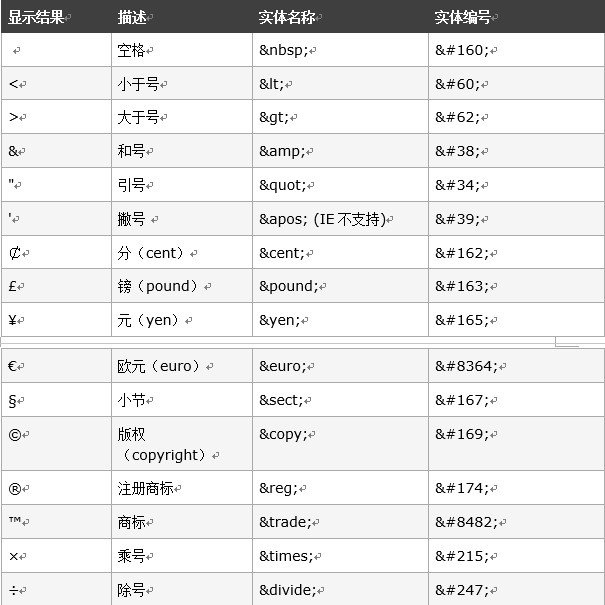
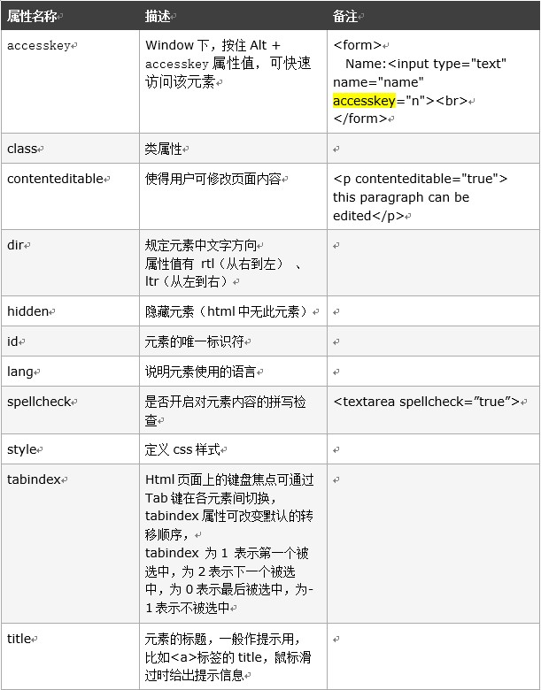

## 基本概念

1. 元素标签不用强制结束，但推荐使用闭合，提高可读性和可维护性 
2. 元素标签多数成对出现，但也包含自闭合的标签，如`
`
3. 元素可以包含多个属性，支持自定义属性，用data- 开头

## 元素类型：
Html5 将元素分为3类：
1. 元数据元素(metadata element)：构建html文档的基本结构，以及就如何处理文档向浏览器提供信息和指示；  
2. 短语元素(phrasing element)：是html的基本成分;   
3. 流元素(flow element)：短语元素的超集。  

## HTML实体
文档中有些内容不想被当做html处理，可使用html 实体(entity) 

## 全局属性
html5中的全局属性  

