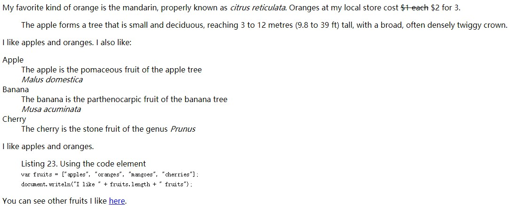

## 组织内容标签

### 组织内容标签
* p 段落
* div
* pre 保留源文档格式，可结合code标签使用
* blockquote 引用
* hr 分隔
* ol 有序列表
* ul 无序列表
* li 列表中元素
* dl dt dd  列表包含一系列术语/说明组合
* figure 一个独立的内容单元，可带标题（figcaption）

```
<!DOCTYPE html>
<html lang="en">
<head>
    <meta charset="UTF-8">
    <title>Title</title>
</head>
<body>

<p>My favorite kind of orange is the mandarin, properly known
    as <i>citrus reticulata</i>.
    Oranges at my local store cost <s>$1 each</s> $2 for 3.</p>

<blockquote cite="http://en.wikipedia.org/wiki/Apple">
    The apple forms a tree that is small and deciduous, reaching 3 to 12 metres
    (9.8 to 39 ft) tall, with a broad, often densely twiggy crown.</blockquote>
I like apples and oranges.
I also like:
<dl>
    <dt>Apple</dt>
    <dd>The apple is the pomaceous fruit of the apple tree</dd>
    <dd><i>Malus domestica</i></dd>
    <dt>Banana</dt>
    <dd>The banana is the parthenocarpic fruit of the banana tree</dd>
    <dd><i>Musa acuminata</i></dd>
    <dt>Cherry</dt>
    <dd>The cherry is the stone fruit of the genus <i>Prunus</i></dd>
</dl>

I like apples and oranges.
<figure>
    <figcaption>Listing 23. Using the code element</figcaption>
    <code>var fruits = ["apples", "oranges", "mangoes", "cherries"];<br>
        document.writeln("I like " + fruits.length + " fruits");
    </code>
</figure>
You can see other fruits I like <a href="fruitlist.html">here</a>.
</body>
</html>
```
## 效果图:
