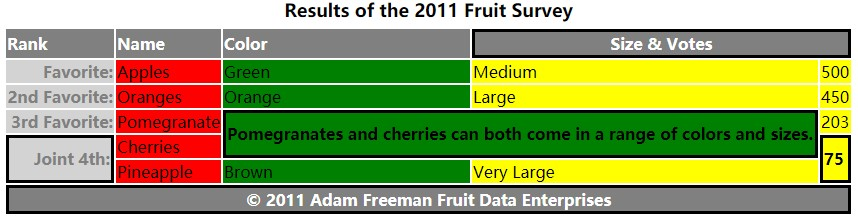

## 表格标签

### 表格标签
* table 表格
* thead 表头
* tbody 表体
* tfoot 表脚
* caption 表格标题
* tr 行
* th 表头单元格
* td 单元格
* colgroup 一组列
* col 指定组中各列

## 表格属性

* colspan 纵跨行数
* rowspan 横跨列数
* span , colgroup 和col均有此属性，指包含的列数
  - colgoup 上的css样式在具体程度上低于直接应用到tr、td、th元素上的样式
  - 不规则单元格被计入其起始列
  - colgoup元素的影响范围覆盖了列中所有单元格，包括thead、tfoot中的单元格
  - col 可以指定组中的各列，以便对组中个别列进行单独控制

```
<!DOCTYPE HTML>
<html>
    <head>
        <title>Example</title>
        <meta name="author" content="Adam Freeman"/>
        <meta name="description" content="A simple example"/>
        <link rel="shortcut icon" href="favicon.ico" type="image/x-icon" />
        <style>
            thead th, tfoot th { text-align:left; background:grey; color:white}
            tbody th { text-align:right; background: lightgrey; color:grey}
            [colspan], [rowspan] {font-weight:bold; border: medium solid black}
            thead [colspan], tfoot [colspan] {text-align:center; }
            caption {font-weight: bold; font-size: large; margin-bottom:5px}
            #colgroup1 {background-color: red}
            #col3 {background-color: green; font-size:small}
            #colgroup2{background-color: yellow;}
        </style>
    </head>
    <body>
        <table>
            <caption>Results of the 2011 Fruit Survey</caption>
            <colgroup id="colgroup1">
                <col id="col1And2" span="2"/>
                <col id="col3" />
            </colgroup>
            <colgroup id="colgroup2" span="2"/>
            <thead>
                <tr>
                    <th>Rank</th><th>Name</th><th>Color</th>
                    <th colspan="2">Size & Votes</th>
                </tr>
            </thead>
            <tbody>
                <tr>
                    <th>Favorite:</th><td>Apples</td><td>Green</td>
                    <td>Medium</td><td>500</td>
                </tr>
                <tr>
                    <th>2nd Favorite:</th><td>Oranges</td><td>Orange</td>
                    <td>Large</td><td>450</td>
                </tr>
                <tr>
                    <th>3rd Favorite:</th><td>Pomegranate</td>
                    <td colspan="2" rowspan="2">
                        Pomegranates and cherries can both come in a range of colors
                        and sizes.
                    </td>
                    <td>203</td>
                </tr>
                <tr>
                    <th rowspan="2">Joint 4th:</th>
                    <td>Cherries</td>
                    <td rowspan="2">75</td>
                </tr>
                <tr>
                    <td>Pineapple</td>
                    <td>Brown</td>
                    <td>Very Large</td>
                </tr>
            </tbody>
            <tfoot>
                <tr>
                    <th colspan="5">&copy; 2011 Adam Freeman Fruit Data Enterprises</th>
                </tr>
            </tfoot>
        </table>
    </body>
</html>

```
## 效果图:
