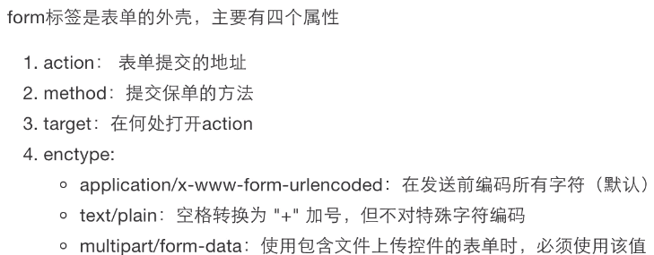

## 表单

### 表单标签

- form
- input
- label 说明标签，for 属性值与 input 的 id 值一致进行关联
- fieldset 表单元素编组
- legend fieldset 元素的说明标签
- button
- datalist 数据列表，包含 option 子标签，常与 input 一起使用（用户可不使用 option 内容）
- textarea
- select ,与 option 一起使用，也可联合 optgroup 使用

```
  <fieldset>
    <legend>健康信息</legend>
    身高：<input type="text" />
    体重：<input type="text" />
  </fieldset>
```

### input 元素的类型

- text
- password
- button
- file
- hidden
- image
- reset
- submit
- checkbox
- date
- color
- email
- number
- month
- radio
- range
- search
- week
- url

### 表单新特性

placeholder: 输入框占位符，常用作提示用户输入的信息
autocomplete:是否保存用户输入信息，默认为 on，关闭为 off
autofocus:自动聚焦
required：必填项
pattern:正则验证
form: 将表单元素属性添加 form 属性，属性值为 form 表单元素的 id 值，表单元素可在页面任意位置（实测浏览器不支持 )
formnovalidate、novalidate:均指不验证表单，formnovalidate 用于 submit 按钮。novalidate 用于 form 标签

### 表单注意事项：

form 表单



1.  提交方式支持:get/post,默认为 get(但一般不用)，一般使用 post；
2.  enctype 默认为 application/x-www-form-urlencoded ，提交的数据按照 key1=val1&key2=val2 的方式进行编码，key 和 val 都进行了 URL 转码；
    enctype 为 multipart/form-data，一般用来上传文件，使用表单 上传文件 时，必须让<form>表单的 enctype 属性值为 multipart/form-data.

get 与 post 区别：

1. get 请求提交的数据直接在地址栏可见，而 post 请求提交的数据在请求体中，地址栏上不可见；
2. get 请求提交的数据由于在地址栏直接可见，因此不安全，而 post 请求提交的数据地址栏不可见，因此相对更安全；
3. get 请求提交的数据的一般较小（如果太大，浏览器会截断信息，造成数据丢失），而 post 请求传递的参数理论上没有限制，可以很大（但实际上受限服务器的处理能力，不可能无限大）

- input name 值：
  name 值作为提交数据的 key 值，如果没有 name，浏览器提交时会忽略该 input 输入的值。
  radio/ checkbox ,name 值必须相同，代表是一组；

- label 标签
  label 标签主要作为标识使用，比如 类型为 text、password 的 inut 输入框，前面添加 label，可标识该输入框需要用户输入什么信息。
  此外，label 标签 for 属性，其属性值取 input 输入框的 id 值，可以使得用户在点击 label 标签时，选中该 input 输入框，方便用户使用。

* http get 请求的长度限制

> http get 请求的长度限制取决于服务器和使用的客户端（如果有用代理，还取决于服务器或客户端使用的代理）。  
> 大多数 Web 服务器的限制为 8192 字节（8KB），这个限制通常可在服务器配置中的某处进行配置。对于客户端，HTTP 1.1 规范甚至警告过这一点，  
> 以下第 3.2.1 章的摘录：

> “注意：服务器应该谨慎依赖长度超过 255 个字节的 URI，因为某些较旧的客户端或代理实现可能无法正确支持这些长度”。

> MSIE 和 Safari 浏览器的大小限制大约 2KB，Opera 的大小限制大约为 4KB，Firefox 大小限制大约 8KB。因此，我们可以认为 8KB 是最大可能长度，  
> 并且 2KB 是服务器端依赖的更可接受的长度，再考虑到整个 URL 的长度限制，255 字节是最安全的长度。  
> 如果超出浏览器或服务器中的限制，大多数服务器或浏览器将仅截断限制之外的字符而不发出任何警告。但是，某些服务器可能会发送 HTTP 414 错误。  
> 如果您需要发送大数据，那么最好使用 POST 而不是 GET。它的长度限制要高得多，但更多地依赖于使用的服务器而不是客户端。  
> 通常，web 服务器一般大小限制高达 2GB 左右，当然这也可以在服务器设置中的某处进行配置。当超过 POST 限制时，服务器一般将显示特定的服务器错误或异常，  
> 通常为 HTTP 500 错误。

application/x-www-form-urlencoded

### file

```
<input type="file" accept="image/gif,image/jpeg"/>
可限制上传的图片格式为gif和jpeg
```

### 表单选中/禁用属性

radio checked

checkbox checked

option selected

button disabled

\*\* 以上表单只要有对应的属性，即使设置为 false ，也会生效（如 disabled= 'false' 禁用仍然生效）
